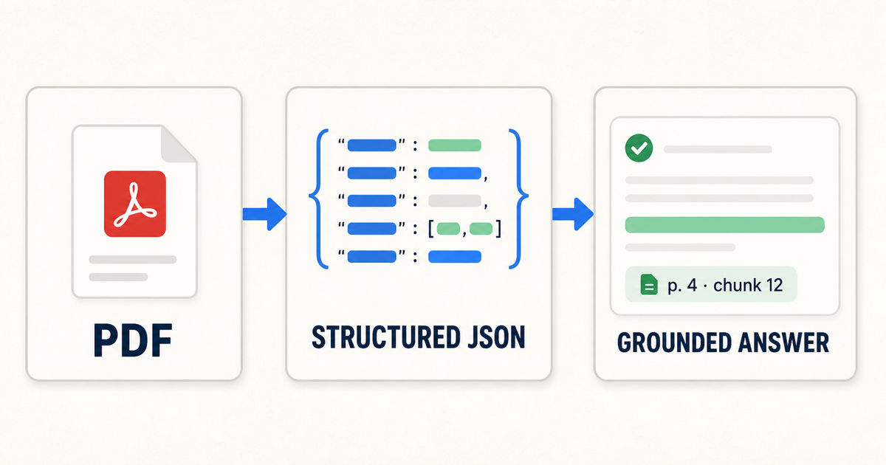
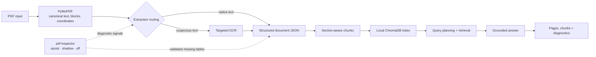

<div align="center">
  <h1>PDF-to-JSON RAG</h1>
  <p><strong>Local-first document intelligence with inspectable extraction, retrieval, and citations.</strong></p>
  <p>Turn unfamiliar PDFs into structured JSON, ask grounded questions, and see exactly which pages and chunks support each answer — without requiring a hosted model or sending documents to a cloud service.</p>
  <p>
    <a href="#two-minute-demo">Try it</a> ·
    <a href="#architecture">Architecture</a> ·
    <a href="#quality-snapshot">Evaluation</a> ·
    <a href="./docs/WEB_INTERFACE.md">Web API</a>
  </p>
  <p><code>Python 3.10–3.13</code> · <code>PyMuPDF</code> · <code>pdf-inspector</code> · <code>ChromaDB</code> · <code>local-first</code></p>
</div>



## Two-minute demo

Start the local web workspace:

```bash
python -m pip install .
pdf-to-json-rag-web --open
```

Or run the complete CLI workflow in one command:

```bash
pdf-to-json-rag run-workflow --pdf /path/to/file.pdf --query "What does this file cover?" --json
```

The web interface and CLI share the same extraction, chunking, indexing, retrieval, and answering pipeline. The browser adds a focused document library and quality inspector; it is not a separate implementation.

## Architecture



PyMuPDF remains the canonical source for reading order, coordinates, and citations. `pdf-inspector` contributes fail-open diagnostics, cautious OCR routing, and only validated missing tables; an inspector failure never blocks the existing extraction path.

## Quality snapshot

| Benchmark | Result | Scope |
| --- | ---: | --- |
| Maintained evaluation suite | **77 / 77 retrieval · 77 / 77 answer faithfulness · Recall@5 1.000 · MRR 1.000** | Checked-in regression cases for retrieval and grounded answers |

These are reproducible regression results on maintained fixtures, not a claim of universal PDF performance. The tracked source is [data/eval/mvp_eval_report.json](./data/eval/mvp_eval_report.json); methodology and additional gates are documented in [docs/PROJECT_DETAILS.md](./docs/PROJECT_DETAILS.md#evaluation-and-release-gates).

## Example grounded answer

**Question**

> What does this file cover?

**Answer**

> This file is a procedural safety guide for operations staff. It covers preparation, incident response, reporting steps, and follow-up work.

| Source | Page | Chunk | Supporting evidence |
| --- | ---: | --- | --- |
| `Demo Safety Guide` | 1 | `pdf-to-json-rag-web-demo-chunk-0001` | Safety checks, incident reporting, evidence collection, supervisor notification, review, and lessons learned |

The answer stays connected to inspectable page and chunk identifiers. If the available evidence is weak or unsupported, the answer contract lowers trust or abstains instead of presenting an ungrounded response as certain.

## Web workspace

The server binds to `127.0.0.1:8765` by default. Add a PDF in the browser, wait for the document to become ready, then ask a question and inspect its cited chunks and extraction signals. It uses the same data directory as the CLI and requires neither Node.js nor a separate frontend build.

Run the web-specific tests from a source checkout:

```bash
PYTHONPATH=src python -m unittest discover -s tests -p 'test_web_app.py'
python -m ruff check src tests
```

For the complete test suite and installed-package gate, run:

```bash
PYTHONPATH=src python -m unittest discover -s tests -p 'test_*.py'
pdf-to-json-rag package-check --json
```

See [docs/WEB_INTERFACE.md](./docs/WEB_INTERFACE.md) for development startup, local storage behavior, and the HTTP API. The longer implementation history and maintainer notes live in [DEVELOPMENT_LOG.md](./DEVELOPMENT_LOG.md).

## Three core capabilities

- **Structured extraction:** turn native-text and scanned PDFs into document JSON and section-aware chunk JSON, retaining page, block, and coordinate provenance.
- **Local retrieval:** build a persistent ChromaDB index and route evidence, overview, document-discovery, and comparison questions without requiring a hosted model.
- **Grounded answers:** return inspectable page and chunk citations, surface extraction diagnostics, and lower trust or abstain when support is weak.

## Workflow

`PDF → structured document JSON → section-aware chunks → local index → planned retrieval → grounded answer + citations`

Extraction, OCR routing, chunking, retrieval, and answer contracts are shared by the web workspace and CLI. The detailed nine-step flow and runtime behavior live in [docs/PROJECT_DETAILS.md](./docs/PROJECT_DETAILS.md).

## Documentation

- [CLI quickstart](./docs/CLI_QUICKSTART.md) — installation and the shortest end-to-end path
- [CLI reference](./docs/CLI_REFERENCE.md) — commands, output contracts, runtime options, and maintainer checks
- [Web interface](./docs/WEB_INTERFACE.md) — local server, storage, user flow, and HTTP API
- [Project details](./docs/PROJECT_DETAILS.md) — complete capabilities, workflow, evaluation gates, and limitations

## Lineage

This is a separate, local-first implementation inspired by the [Document AI: From OCR to Agentic Doc Extraction](https://learn.deeplearning.ai/courses/document-ai-from-ocr-to-agentic-doc-extraction/information) course, its [upstream repository](https://github.com/https-deeplearning-ai/sc-landingai), and selected architecture ideas from Google's LangExtract project.

The course reproduction and AWS-side learning path remain in [Evanthel/sc-landingai](https://github.com/Evanthel/sc-landingai). This repository is JSON-first and independently controls extraction, chunking, retrieval, grounding, and evaluation; additional reference notes are in [docs/PROJECT_DETAILS.md](./docs/PROJECT_DETAILS.md#reference-material).
