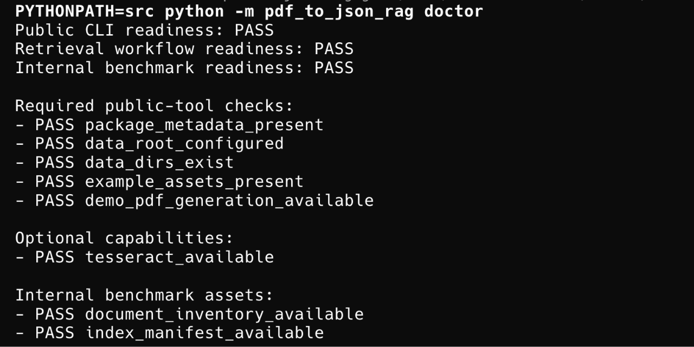

# PDF-to-JSON RAG

Local-first, domain-agnostic PDF-to-JSON RAG tool for turning PDFs into structured JSON, routing queries across documents, and returning grounded CLI answers.



## Lineage

This repo is a personal implementation inspired by:

- the upstream course repo [https-deeplearning-ai/sc-landingai](https://github.com/https-deeplearning-ai/sc-landingai)
- the course [Document AI: From OCR to Agentic Doc Extraction](https://learn.deeplearning.ai/courses/document-ai-from-ocr-to-agentic-doc-extraction/information)

The working course fork and setup/debug history are preserved separately in:

- [Evanthel/sc-landingai](https://github.com/Evanthel/sc-landingai)

This codebase is intentionally separate from that fork. The fork captures the baseline course reproduction and AWS-side learning path; this repo moves toward a local-first, JSON-first implementation with tighter control over chunking, retrieval, and evaluation.

## Current Status

Current public version: `0.1.0-beta`

Internal development iterations in this repo use `v1.x` labels. Public releases follow semantic versioning starting at `0.1.0-beta`.

Current internal milestone: `v1.4.0`

The current baseline includes:

- extraction-time block roles with per-block text provenance and quality signals
- native/OCR page fusion that can merge or switch sources per page instead of one global fallback
- extraction-time layout signals and per-page processing summaries
- extraction-time sections with `section_path` and `section_kind`
- section roles, layout signals, text-source profiles, and source-block traces carried from extraction into inspection and chunking
- structure-aware chunking and chunk metadata
- chunk-level block provenance, block-role profiles, layout signals, and explicit chunk strategies
- feature-based query planning and explicit `document_selection` traces
- shared document-level mode renderers and shared answer finalization helpers
- preserved document-root section context for inline and synthetic section splits
- shared structured-form answer helpers and a dedicated structured-form maintenance gate
- document and chunk `structure_confidence` / `layout_confidence` metadata
- sanity gates for layout robustness and single-document random-PDF behavior
- stronger table-like and form-heavy chunk splitting on unfamiliar layouts
- dedicated table/form layout sanity gates in the maintainer release path
- richer document typing and purpose inference for unfamiliar financial/admin forms
- distinct document-level answers for type, purpose, audience, and overview queries
- a semantic document-understanding gate for source-specific type/purpose/audience questions
- semantic confidence signals and confidence-aware document classification answers
- explicit classification-rationale and classification-limits answers for trust-aware document semantics
- a local corpus sampler over repo-local `pdf/` artifacts and metadata for unknown-document sanity checks
- stronger unknown-document typing for registration forms, court opinions, government bulletins, and inspection-style records
- corpus-level semantic pass metrics so unfamiliar PDFs are tracked as semantically understood vs only technically processable
- a dedicated `processing_layer_core` maintainer gate for block typing, section roles, and chunk provenance
- a dedicated `processing_strategy_core` maintainer gate for strategy-aware chunking on structure-heavy inputs
- an explicit `retrieval_contract` split for single-document QA, document understanding, and cross-document discovery
- a shared `document_synthesis` handoff so document selection, support scope, and answer chunks stay aligned
- a layer-aware evaluation report that separates processing, retrieval, and answer-faithfulness signals
- layer-stability and architecture-gate summaries on top of the layer-aware evaluation report
- corpus-level `processing / semantics / trust` layers and an unknown-document architecture gate
- compact default JSON output with richer debug state behind `--verbose`
- deterministic local embeddings by default, with optional `sentence-transformers`

Validation state:

- public CLI tests rerun in the current milestone: green
- processing-layer maintainer shards rerun in the current milestone: green
- retrieval-contract maintainer shard rerun in the current milestone: green
- retrieval-synthesis maintainer shard rerun in the current milestone: green
- evaluation-layer public/unit validation rerun in the current milestone: green
- layer-gate validation rerun in the current milestone: green
- corpus-gate validation rerun in the current milestone: green
- latest saved full 77-case benchmark: green
  - `precision@5 = 0.6031`
  - `recall@5 = 1.0`
  - `MRR = 1.0`
  - `avg_keyword_coverage = 1.0`
  - `negative_success_rate = 1.0`
  - `warning_case_count = 0`
- sampled faithfulness audit: green
  - `avg_supported_sentence_ratio = 1.0`
  - `failing_case_count = 0`

Current engineering direction:

- keep strengthening the processing layer as the primary baseline for downstream retrieval behavior
- keep retrieval behavior aligned to explicit answer-path contracts instead of one shared fallback path
- keep improving unknown-document semantics on unfamiliar PDFs without hiding uncertainty
- keep using the repo-local `pdf/` corpus as a local-only semantic stress test, not just a layout stress test
- keep learned reranking deferred until the heuristic baseline stops being sufficient

## Capabilities

- Extract native-text PDFs into document-level and chunk-level JSON artifacts.
- Fall back to OCR with `pytesseract` when native extraction is weak or missing.
- Build a local vector index with `ChromaDB`.
- Carry extraction-time document sections into chunking, inspection, and document-level synthesis.
- Answer single-document evidence questions with grounded citations.
- Route document-level and cross-document queries such as:
  - `What does this file cover?`
  - `What kind of document is this?`
  - `Which file is most relevant for X?`
  - `Why is this the best source?`
  - `What do these sources have in common or how do they differ?`
- Expose inspection and planning paths through a packaged CLI:
  - `list-documents`
  - `inspect-document`
  - `plan-query`
  - `answer-query`
  - `run-workflow`
  - `smoke-check`
- Expose maintainer-facing release gates through:
  - `package-check`
  - `release-check`
  - `layout-sanity-check`
  - `corpus-sanity-check`

## Workflow

1. Extract a PDF into `*.native.json` and `*.document.json`
2. Convert extracted blocks into chunk JSON files
3. Build a persistent local vector index from chunk text and metadata
4. Plan the query as evidence lookup, document discovery, cross-document, or document-facet behavior
5. Shortlist candidate documents from inventory metadata when the query needs document-level routing
6. Retrieve top-k chunks for the shortlisted sources
7. Expand with adjacent chunks when needed
8. Assemble a grounded answer from the expanded context, or a source-level / document-level answer for source discovery, comparison, overview, routing, and facet questions
9. Evaluate the result on the full benchmark or on a smaller regression shard

## Quickstart

```bash
python -m pip install .
export PDF_TO_JSON_RAG_DATA_DIR="$(mktemp -d)"
pdf-to-json-rag init --json
pdf-to-json-rag doctor --json
pdf-to-json-rag create-demo-pdf --path /tmp/pdf-to-json-rag-demo.pdf --json
pdf-to-json-rag smoke-check --pdf /tmp/pdf-to-json-rag-demo.pdf --query "What does this file cover?" --json
```

Use a fresh `PDF_TO_JSON_RAG_DATA_DIR` for quickstart and release-check runs so old local artifacts do not make `doctor` or `release-check` look greener than the current session really is.

The current baseline is still heuristic-first. It now behaves more sanely on unfamiliar financial/admin forms, carries richer extraction-time block structure into chunking and inspection, and can separate type, purpose, audience, and overview answers, but unfamiliar layouts can still degrade section recovery and answer confidence.

Optional stronger local embeddings:

```bash
export PDF_TO_JSON_RAG_USE_SENTENCE_TRANSFORMERS=1
```

Fastest full workflow:

```bash
pdf-to-json-rag run-workflow --pdf /tmp/pdf-to-json-rag-demo.pdf --query "What does this file cover?" --json
```

Maintainer release validation:

```bash
pdf-to-json-rag package-check --json
pdf-to-json-rag release-check --json
```

Local sanity check for unfamiliar PDFs:

```bash
pdf-to-json-rag layout-sanity-check --pdfs /path/a.pdf,/path/b.pdf --json
```

That local sanity path now returns compact overview, type, purpose, audience, confidence, rationale, and limits answers so you can see whether an unfamiliar PDF is only processable or also semantically understood.

Local corpus sanity check over the repo-local `pdf/` directory:

```bash
pdf-to-json-rag corpus-sanity-check --sample-size 12 --json
```

That local-only corpus path now reports both `technical_all_pass` and `semantic_all_pass`, plus rates for specific document typing, specific purpose inference, low-confidence classifications, trust-limited results, and a compact corpus architecture gate over `processing`, `semantics`, and `trust`.

When you want to inspect the new processing layer on one extracted document, `inspect-document --json` now includes `extraction_summary.block_role_counts`, `extraction_summary.text_source_counts`, `extraction_summary.layout_signal_counts`, and per-section `section_role` / `source_block_roles`.

Document-level answer traces now also include compact `retrieval_contract` and `document_synthesis` blocks so you can see both the retrieval path and how the answer path narrowed support to selected documents and chunks.

When you are validating new local code in a source checkout before reinstalling the package, prefer:

```bash
PYTHONPATH=src python -m pdf_to_json_rag release-check --json
PYTHONPATH=src python -m pdf_to_json_rag evaluate-mvp --top-k 5 --json
```

For end users, the main public validation path is still:

```bash
pdf-to-json-rag smoke-check --pdf /tmp/pdf-to-json-rag-demo.pdf --query "What does this file cover?" --json
```

More detailed usage lives in:

- [docs/CLI_QUICKSTART.md](./docs/CLI_QUICKSTART.md)
- [docs/CLI_REFERENCE.md](./docs/CLI_REFERENCE.md)

## Key Files

- `src/pdf_to_json_rag/`
  Core extraction, chunking, retrieval, answering, and evaluation code.
- `docs/CLI_QUICKSTART.md`
  Shortest packaged CLI path.
- `docs/CLI_REFERENCE.md`
  User-facing command reference.
- `project-plan.md`
  Master plan and current roadmap.
- `DEVELOPMENT_LOG.md`
  Internal implementation history.
- `examples/`
  Public-safe demo assets and example outputs.
- `data/eval/`
  Benchmark cases and generated reports.

## Evaluation Snapshot

The saved evaluation report includes:

- per-case retrieval, answer-trace, and evidence snapshots
- slice reporting for document discovery, structure-heavy inputs, and source-anchored cases
- compact maintainer shards for planning, structure, selection, anchors, semantics, confidence-aware document understanding, and relationship reasoning
- a layer-aware summary for `processing`, `retrieval`, and `answer_faithfulness`
- a trust-policy shard for classification rationale and classification limits answers
- processing-layer shards for block typing, section-role recovery, chunk provenance, and strategy-aware chunking
- a retrieval-contract shard that keeps single-doc, doc-understanding, and cross-doc paths separated in regression coverage
- a retrieval-synthesis shard that keeps document selection, support scope, and answer-chunk handoff aligned
- extra sanity shards for layout, single-document, table-like, and form-heavy behavior, plus a sampled faithfulness audit
- a local corpus sanity pass that distinguishes technical success from semantic success on repo-local unknown PDFs

Current gate status:

- public release gates are green
- the maintainer shard set used by `release-check` is green
- `release-check` distinguishes public checks, maintainer checks, and benchmark-only regressions
- the current focus is preserving the structure-aware, heuristic-first baseline and broadening unknown-document semantics rather than adding a learned reranker
- the current focus is moving more unfamiliar PDFs out of `document/reference_lookup` while keeping confidence signalling honest

## Limitations

- OCR fallback is still heuristic and not fully layout-aware
- Section detection is improved, but still rule-based and fragile on unfamiliar layouts
- Chunking and document-level reasoning are still heuristic-first rather than learned
- Retrieval still depends on heuristic scoring, structure cues, and lightweight reranking
- Stronger local sentence-transformer embeddings are opt-in; the default public path uses deterministic fallback embeddings
- Document facets, document families, shortlist decisions, and type/purpose/audience inference are still handcrafted metadata layers
- Grounded answers are extractive, not LLM-synthesized
- The benchmark is still hand-built and not broad enough to prove true generalization
- The scanned and structure-heavy coverage is still modest
- The faithfulness audit is still a checkpoint, not a substitute for broader human review
- Multilingual robustness is not validated yet

## Notes on Reference Material

This repo was brainstormed with ideas from:

- [DeepLearning.AI Skill Builder](https://skillbuilder.deeplearning.ai/)
- ChatGPT 5.4

Earlier in development, a small set of course notebooks from [Document AI: From OCR to Agentic Doc Extraction](https://learn.deeplearning.ai/courses/document-ai-from-ocr-to-agentic-doc-extraction/information) was copied into a temporary `references/` folder and used only as design input for OCR fallback planning, reading-order/layout handling, schema design, and grounding-aware RAG flow.

Those reference notebooks were removed from the final repo structure. The current codebase is a separate local implementation rather than a notebook-derived copy.
