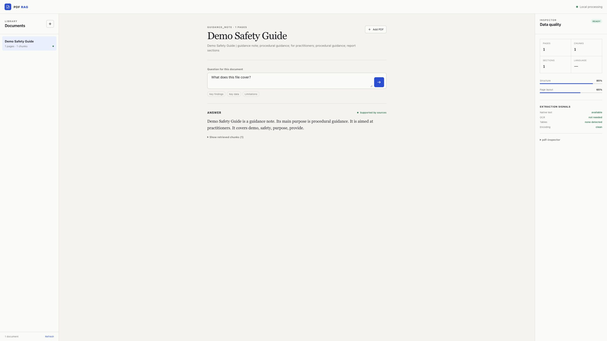
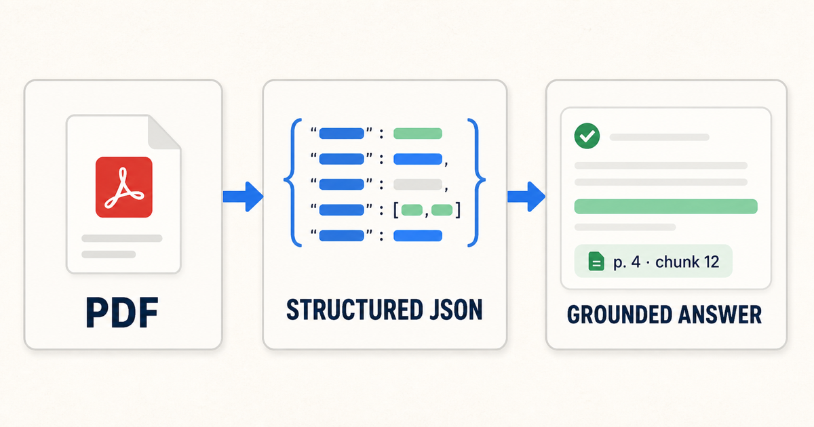
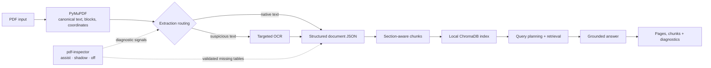

<div align="center">
  <h1>PDF-to-JSON RAG</h1>
  <p><strong>Local-first document intelligence with inspectable extraction, retrieval, and citations.</strong></p>
  <p>Turn unfamiliar PDFs into structured JSON, ask grounded questions, and see exactly which pages and chunks support each answer — without requiring a hosted model or sending documents to a cloud service.</p>
  <p>
    <a href="#two-minute-demo">Try it</a> ·
    <a href="#architecture">Architecture</a> ·
    <a href="#quality-snapshot">Evaluation</a> ·
    <a href="./docs/WEB_INTERFACE.md">Web API</a>
  </p>
  <p><code>Python 3.10–3.13</code> · <code>PyMuPDF</code> · <code>pdf-inspector</code> · <code>ChromaDB</code> · <code>local-first</code></p>
</div>



The local workspace keeps the document library, grounded answer, retrieved chunks, and extraction-quality signals in one inspectable view.

## Two-minute demo

Start the local web workspace:

```bash
python -m pip install .
pdf-to-json-rag-web --open
```

Or run the complete CLI workflow in one command:

```bash
pdf-to-json-rag run-workflow --pdf /path/to/file.pdf --query "What does this file cover?" --json
```

The web interface and CLI share the same extraction, chunking, indexing, retrieval, and answering pipeline. The browser adds a focused document library and quality inspector; it is not a separate implementation.

## Architecture




```mermaid
flowchart LR
    PDF["PDF input"] --> Native["PyMuPDF<br/>canonical text, blocks, coordinates"]
    Inspector["pdf-inspector<br/>assist · shadow · off"] -. diagnostic signals .-> Route{"Extraction routing"}
    Native --> Route
    Route -->|native text| Document["Structured document JSON"]
    Route -->|suspicious text| OCR["Targeted OCR"]
    OCR --> Document
    Inspector -. validated missing tables .-> Document
    Document --> Chunks["Section-aware chunks"]
    Chunks --> Index["Local ChromaDB index"]
    Index --> Retrieval["Query planning + retrieval"]
    Retrieval --> Answer["Grounded answer"]
    Answer --> Evidence["Pages, chunks + diagnostics"]
```

PyMuPDF remains the canonical source for reading order, coordinates, and citations. `pdf-inspector` contributes fail-open diagnostics, cautious OCR routing, and only validated missing tables; an inspector failure never blocks the existing extraction path.

## Quality snapshot

| Benchmark | Result | Scope |
| --- | ---: | --- |
| Maintained evaluation suite | **77 / 77 retrieval · 77 / 77 answer faithfulness · Recall@5 1.000 · MRR 1.000** | Checked-in regression cases for retrieval and grounded answers |
| Required public-PDF CI shard | **6 / 6 cases · Recall@5 1.000 · MRR 1.000 · evidence coverage 1.000** | Three downloaded and SHA-256-verified public PDFs processed through extraction, chunking, indexing, and retrieval |

These are reproducible regression results, not a claim of universal PDF performance. The tracked sources are [data/eval/mvp_eval_report.json](./data/eval/mvp_eval_report.json) and the [public-PDF benchmark snapshot](./data/eval/public_pdf_benchmark_snapshot.json); methodology and additional gates are documented in [docs/PROJECT_DETAILS.md](./docs/PROJECT_DETAILS.md#evaluation-and-release-gates).

## Runtime trade-offs

The three local retrieval paths were measured on the same 77 cases, `k=5`, and 2,071 chunks. Each embedding backend received a fresh index built from the same chunks; both local models were active and the cross-encoder had zero fallbacks.

| Mode | Quality | Query latency: mean / p50 / p95 | Index and hardware cost | Current role |
| --- | --- | ---: | --- | --- |
| Hash baseline + lightweight reranker | **77/77 · Recall@5 0.981 · MRR 1.000** | **165 / 125 / 450 ms** | 1.3 s index build · CPU · no model weights | Lowest-cost offline fallback |
| `all-MiniLM-L6-v2` + lightweight reranker | **77/77 · Recall@5 0.981 · MRR 1.000** | **182 / 143 / 460 ms** | 19.2 s index build · CPU, optional GPU · 86.7 MiB primary weights | Preferred semantic backend when already cached |
| Hash baseline + `ms-marco-MiniLM-L-6-v2` cross-encoder | **77/77 · Recall@5 0.981 · MRR 1.000** | **402 / 331 / 877 ms** | Reuses hash index · CPU, optional GPU · 86.7 MiB primary weights | Experimental opt-in reranker |

On this benchmark, neither learned path improved quality. The sentence-transformer path added about 11% mean query latency, while the cross-encoder was about 2.4× slower than baseline. That supports keeping `auto` offline-safe — use the sentence transformer only when it is already cached, fall back to hash otherwise, and keep the cross-encoder opt-in until it wins on a broader corpus.

Latency was measured in one local process on Darwin arm64 with Python 3.13.9 and includes first-use model loading; absolute values are machine-specific. Weight sizes refer only to the primary `safetensors` files, not total Python runtime memory or every cached model format. The compact, reviewable source is [data/eval/runtime_backend_comparison_snapshot.json](./data/eval/runtime_backend_comparison_snapshot.json); the full per-case report is generated locally and ignored by Git.

## Reproducible generated output

This is not a hand-written example. The fields below were copied from the actual JSON produced by the public demo workflow with model downloads disabled:

```bash
pdf-to-json-rag create-demo-pdf --path /tmp/demo-safety-guide.pdf --json
pdf-to-json-rag run-workflow \
  --pdf /tmp/demo-safety-guide.pdf \
  --query "What does this file cover?" \
  --json
```

```json
{
  "doc_id": "demo-safety-guide",
  "document": {
    "page_count": 1
  },
  "index": {
    "chunk_count": 1,
    "embedding": {
      "effective_backend": "hash-fallback"
    }
  },
  "answer": {
    "query": "What does this file cover?",
    "answer": "Demo Safety Guide is a guidance note. Its main purpose is procedural guidance. It is aimed at practitioners. It covers demo, safety, purpose, provide."
  },
  "quality_profile_summary": {
    "overall_status": "pass"
  }
}
```

The full response also includes the retrieval contract, selected document and chunks, processing diagnostics, and answer-quality signals. If support is weak or unsupported, the answer contract lowers trust or abstains instead of presenting an ungrounded response as certain.

## Web workspace

The server binds to `127.0.0.1:8765` by default. Add a PDF in the browser, wait for the document to become ready, then ask a question and inspect its cited chunks and extraction signals. It uses the same data directory as the CLI and requires neither Node.js nor a separate frontend build.

Run the web-specific tests from a source checkout:

```bash
PYTHONPATH=src python -m unittest discover -s tests -p 'test_web_app.py'
python -m ruff check src tests
```

For the complete test suite and installed-package gate, run:

```bash
PYTHONPATH=src python -m unittest discover -s tests -p 'test_*.py'
pdf-to-json-rag package-check --json
```

See [docs/WEB_INTERFACE.md](./docs/WEB_INTERFACE.md) for development startup, local storage behavior, and the HTTP API. The longer implementation history and maintainer notes live in [DEVELOPMENT_LOG.md](./DEVELOPMENT_LOG.md).

## Three core capabilities

- **Structured extraction:** turn native-text and scanned PDFs into document JSON and section-aware chunk JSON, retaining page, block, and coordinate provenance.
- **Local retrieval:** build a persistent ChromaDB index and route evidence, overview, document-discovery, and comparison questions without requiring a hosted model.
- **Grounded answers:** return inspectable page and chunk citations, surface extraction diagnostics, and lower trust or abstain when support is weak.

## Workflow

`PDF → structured document JSON → section-aware chunks → local index → planned retrieval → grounded answer + citations`

Extraction, OCR routing, chunking, retrieval, and answer contracts are shared by the web workspace and CLI. The detailed nine-step flow and runtime behavior live in [docs/PROJECT_DETAILS.md](./docs/PROJECT_DETAILS.md).

## Documentation

- [CLI quickstart](./docs/CLI_QUICKSTART.md) — installation and the shortest end-to-end path
- [CLI reference](./docs/CLI_REFERENCE.md) — commands, output contracts, runtime options, and maintainer checks
- [Web interface](./docs/WEB_INTERFACE.md) — local server, storage, user flow, and HTTP API
- [Public benchmark corpus](./docs/PUBLIC_CORPUS.md) — reviewed, licensed PDFs and the required CI shard
- [Project details](./docs/PROJECT_DETAILS.md) — complete capabilities, workflow, evaluation gates, and limitations
- [Changelog](./CHANGELOG.md) — public release highlights and validation snapshots

## Lineage

This is a separate, local-first implementation inspired by the [Document AI: From OCR to Agentic Doc Extraction](https://learn.deeplearning.ai/courses/document-ai-from-ocr-to-agentic-doc-extraction/information) course, its [official course materials repository](https://github.com/https-deeplearning-ai/sc-landingai), and selected architecture ideas from Google's LangExtract project.

The course reproduction and AWS-side learning path remain in [Evanthel/sc-landingai](https://github.com/Evanthel/sc-landingai). This repository is JSON-first and independently controls extraction, chunking, retrieval, grounding, and evaluation; additional reference notes are in [docs/PROJECT_DETAILS.md](./docs/PROJECT_DETAILS.md#reference-material).
